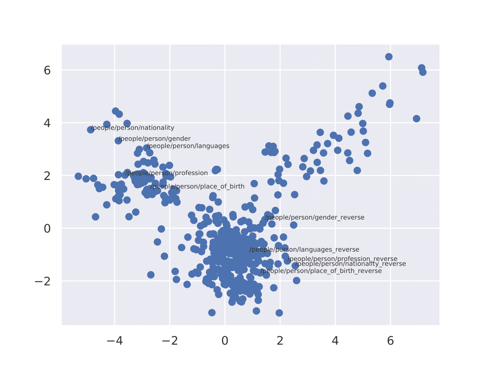

# Convolutional Complex Knowledge Graph Embeddings

This open-source project contains the Pytorch implementation of our approach (ConEx), training and evaluation scripts.
To foster further reproducible research and alleviate hardware requirements to reproduce the reported results, we provide pretrained ConEx on FB15K, FB15K-237, WN18, WN18RR and YAGO3-10.

## Link Prediction Results
In the below, we provide a brief overview of the link prediction results. For more details, we refer to our research paper.

#### WN18 (Wordnet)

|         |   MRR | Hits@1 | Hits@3 | Hits@10 |                                                            
|---------|------:|-------:|-------:|--------:|
| DistMult| .82   | .73    | .91    |   .94   |
| ComplEx | .94   | .94    | .94    |   .95   |   
| ConvE   | .94   | .94    | .95    |   .96   |   
| SimplE  | .94   | .94    | .94    |   .95   |   
| TuckER  | .95   | .95    | .96    |   .96   |   
| HypER   | .95   | .96    | .96    |   .96   |   
| QuatE   | .95   | .94    | .95    |   .96   |
| ConEx   |**.98**|**.98** | **.98**|**.98**  |   

#### FB15K (Freebase)

|         |   MRR | Hits@1 | Hits@3 | Hits@10 |
|---------|------:|-------:|-------:|--------:|
| DistMult| .65   | .55    | .73    |   .82   |
| ComplEx | .69   | .60    | .76    |   .84   |   
| ConvE   | .66   | .56    | .72    |   .83   |   
| SimplE  | .73   | .66    | .77    |   .84   |   
| TuckER  | .80   | .74    | .83    |   .89   |   
| HypER   | .79   | .73    | .83    |   .89   |   
| QuatE   | .83   | .80    | .86    |   .90   |
| ConEx   |**.87**|**.84** |**.90** |**.93**  |   

#### FB15K-237 (Freebase)
|         |   MRR | Hits@1 | Hits@3 | Hits@10 |
|---------|------:|-------:|-------:|--------:|
| ComplEx | .35   |  -     |  -     |   .54   |
| ConvE   | .33   |  .24   |  .36   |   .50   |
| HypER   | .34   |  .25   |  .38   |   .52   |
| RotatE  | .39   |  .21   |  .33   |   .48   |
| TuckER  | .36   |  .27   |  .39   |   .54   |
| ConEx   | .35   |  .26   |  .39   |   .54   |   
| ConEx-TuckER|**.37**|  **.28**   |  **.41**   |   **.57**   |   

#### WN18RR (Wordnet)
|         |   MRR | Hits@1 | Hits@3 | Hits@10 |
|---------|------:|-------:|-------:|--------:|
| ComplEx | .47   |  -     |  -     |   .55   |
| ConvE   | .43   |  .40   |  .44   |   .52   |
| HypER   | .47   |  .44   |  .48   |   .52   |
| RotatE  | .47   |  .42   |  .49   |   .57   |
| TuckER  | .47   |  .44   |  .48   |   .53   |
| ConEx   | .48   |  .45   |  .49   |   .55   | 
| ConEx-TuckER|**.51**|**.48**|**.53**|**.58**|   

#### WN18RR* (Wordnet)
|         |   MRR | Hits@1 | Hits@3 | Hits@10 |
|---------|------:|-------:|-------:|--------:|
| ConEx   | 0.51 |  0.48 |  0.52 |   0.58 | 


#### YAGO3-10
|         |   MRR | Hits@1 | Hits@3 | Hits@10 |
|---------|------:|-------:|-------:|--------:|
| RotatE  | .50   |  0.40  |  .55  |  .67    |
| ConEx   | .55   |  0.48  |  .60  |  .70   | 

## WN18RR* dataset
We spot flaws on WN18RR, FB15K-237 and YAGO3-10. More specifically, the validation and test splits of the dataset contain entities that do not occur in the training split

## Visualisation of Embeddings
A 2D PCA projection of relation embeddings on the FB15K-237 dataset.



## Installation

First clone the repository:
```
git clone https://github.com/dice-group/Convolutional-Complex-Knowledge-Graph-Embeddings.git
```
Then obtain the required libraries:
```
conda env create -f environment.yml
source activate conex
```
The code is compatible with Python 3.6.4


## Reproduce link prediction results
- Unzip the datasets: ```unzip KGs.zip```
- Download pretrained models via [Google Drive](https://drive.google.com/drive/folders/1QkI6C3otXU7xylt_JDtFTf6VybU0Q2bH?usp=sharing) :```unzip PretrainedModels.zip```
- Reproduce reported link prediction results: ``` python reproduce_lp.py```
- Reproduce reported link prediction results on WN18RR*, FB15K-237* and YAGO3-10*:``` python reproduce_lp_new.py```


## Acknowledgement 
We based our implementation on the open source implementation of [TuckER](https://github.com/ibalazevic/TuckER).

## How to cite
```
@inproceedings{
  XXX,
  title={Convolutional Complex Knowledge Graph Embeddings},
  author={Caglar Demir and and Axel-Cyrille Ngonga Ngomo},
  booktitle={XXX},
  year={2021},
}
```